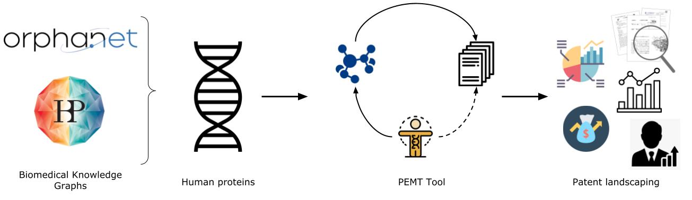

<h1 align="center">
  Pharmaceutical patent landscaping: A novel approach to understand patents from the drug discovery perspective
  <br/>

[//]: # ( [![DOI:10.1093/bioinformatics/btac716]&#40;http://img.shields.io/badge/DOI-110.1093/bioinformatics/btac716-B31B1B.svg&#41;]&#40;https://doi.org/10.1093/bioinformatics/btac716&#41;)

</h1>

The repository contains the code base for generating and analysing patent corpora for drug discovery aspects.

<p align="center">
  
</p>

## Publication

To understand in depth the applicability of patent landscaping in drug research and discovery, we recommend reading our
publication titled [**Pharmaceutical patent landscaping: A novel approach to understand patents from the drug discovery
perspective**](https://doi.org/10.1101/2023.02.10.527980).

> Pharmaceutical patent landscaping: A novel approach to understand patents from the drug discovery perspective. Yojana Gadiya, Philip Gribbon, Martin Hofmann-Apititus, Andrea Zaliani. *bioRxiv* 2023.02.10.527980; doi:[https://doi.org/10.1101/2023.02.10.527980](https://doi.org/10.1101/2023.02.10.527980)

If you have found this work useful, please consider citing us.

## Resource overview

We utilized [OrphaNet](https://www.orpha.net/consor/cgi-bin/index.php), an open-source network focused on rare diseases,
and the [Human Brain Pharmacome (HBP)](https://www.scai.fraunhofer.de/en/projects/Human-Brain-Pharmacome.html), a
biomedical knowledge graph representing the Alzheimer's disease landscape, as the sources for our data for patent
corpora generation.

For generation of the patent corpora, we made use of the [PEMT](https://github.com/Fraunhofer-ITMP/PEMT) tool.

## Code reproducibility

To re-run the pipeline for corpus generation, you can use the [`alzheimer.py`](src/alzheimers.py)
and [`rare_disease.py`](src/rare_disease.py).

To perform and validate the analysis done, we have deposited a number of notebooks based on the section number found in
the manuscript. You can find these notebooks in the [notebooks](notebooks) folder.

## Analysis overview

With the patent corpora generated, we performed landscaping at various aspects. The overall patent landscaping from a
drug discovery perspective can be performed in the following modalities:

1. Looking into specific patent class annotations to understand what is the scope of the patent within in the corpora (
   analysis found in [3_1_patent_overview.ipynb](notebooks%2F3_1_patent_overview.ipynb))
2. Looking into top patent inventors to understand the competitive landscape for the disease of interest (analysis found
   in [3_2_inventor_overview.ipynb](notebooks%2F3_2_inventor_overview.ipynb))
3. Looking into target importance from a market perspective and understanding the prioritisation of future ranking for
   drug targets (analysis found in [3_3_target_overview.ipynb](notebooks%2F3_3_target_overview.ipynb))
4. Looking into the drug repurposing scenarios from the patent drug-target relations and possible with legal assistance
   can be leverage as a resource for "freedom-of-operation" within the patenting world (analysis found
   in [3_4_clinical_phase_overview.ipynb](notebooks%2F3_4_clinical_phase_overview.ipynb))

For each of the cases mentioned above, the conclusion on the drug R&D utility would require an additive analysis
mentioned in detail in our manuscript.

## Issues

If you have difficulties using the codebase, please open an
issue [here](https://github.com/Fraunhofer-ITMP/Pharmaceutical-patent-landscaping/issues).

## Repository structure

```
|-- README.md
|-- data
|   |-- figures
|   |   |-- figure_1.jpg
|   |   |-- figure_2.png
|   |   |-- figure_3.png
|   |   |-- figure_4.png
|   |   |-- figure_5.png
|   |   |-- figure_6.png
|   |   |-- figure_7.png
|   |   |-- supplementary_figure_1.png
|   |   |-- supplementary_figure_2.png
|   |   |-- supplementary_figure_3A.png
|   |   `-- supplementary_figure_3B.png
|   |-- mapper
|   |   |-- ad_chem_smile_mapper.json
|   |   |-- ad_chemical_max_phase.tsv
|   |   |-- ad_chemical_names.json
|   |   |-- ad_gene_to_chemicals.json
|   |   |-- assignee
|   |   |   |-- README.md
|   |   |   |-- acquired.tsv
|   |   |   |-- individual.tsv
|   |   |   `-- organization.tsv
|   |   |-- orphanet_chem_smile_mapper.json
|   |   |-- orphanet_chemical_max_phase.tsv
|   |   |-- orphanet_chemical_names.json
|   |   `-- orphanet_gene_to_chemicals.json
|   |-- patent_dumps
|   |   |-- ad_chemicals.tsv
|   |   |-- ad_gene_enumerated_patent_data.tsv
|   |   |-- ad_normalized_patent_data.tsv
|   |   |-- ad_patent_data.tsv
|   |   |-- orphanet_chemicals.tsv
|   |   |-- orphanet_gene_enumerated_patent_data.tsv
|   |   |-- orphanet_normalized_patent_data.tsv
|   |   `-- orphanet_patent_data.tsv
|   `-- raw
|       |-- ad_proteins.csv
|       |-- en_product6.xml
|       `-- orphanet_2021.tsv
|-- notebooks
|   |-- 2_1_data_overview.ipynb
|   |-- 3_1_patent_overview.ipynb
|   |-- 3_2_inventor_overview.ipynb
|   |-- 3_2_inventor_overview_academia.ipynb
|   |-- 3_3_target_overview.ipynb
|   |-- 3_4_clinical_phase_overview.ipynb
|   `-- 3_4_modulator_overview.ipynb
|-- requirements.txt
`-- src
    |-- __init__.py
    |-- alzheimers.py
    |-- constants.py
    |-- normalizer.py
    |-- rare_disease.py
    `-- util.py
```
